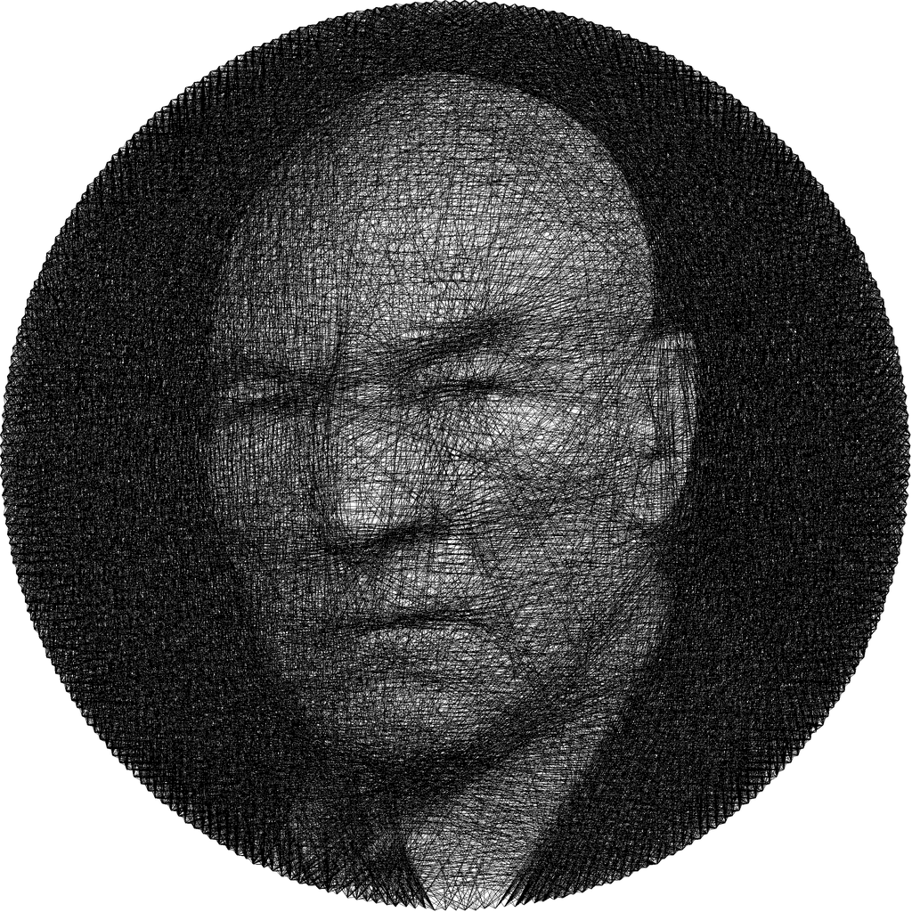

# String Art Project

This project is a Python-based application that creates a string art representation of a given image.


[](https://www.youtube.com/watch?v=oIXXaKVdeNM)


## Features

- Creates a string art representation of an image.
- Can produce outputs in .PNG, .MP4 formats, and a JSON file with instructions on which pin to run the thread next.
- Pin 0 is at the rightmost point and moves up counterclockwise.

## Installation

1. Clone the repository:
  ```sh
  git clone https://github.com/isandrocks/ThreadArt.git
  ```
2. Navigate to the project directory:
  ```sh
  cd ThreadArt
  ```
3. Install the required dependencies:
  ```sh
  pip install -r requirements.txt
  ```

## Usage

1. Run the main script:
  ```sh
  SA_GUI.py
  ```
2. Follow the on-screen instructions to manipulate your images.

## Contributing

Contributions are welcome! Please fork the repository and submit a pull request.

## License

This project is licensed under the MIT License. See the [LICENSE](LICENSE) file for details.

## Contact

For any questions or suggestions, please open an issue or contact the project maintainer at consavecustoms@gmail.com.