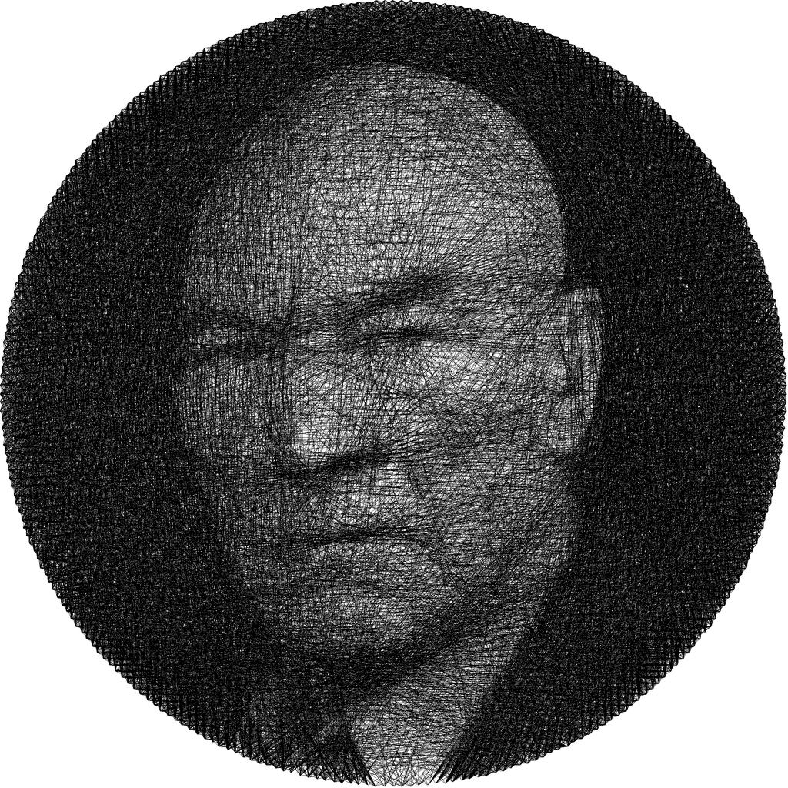

# String Art Project

This project is a Python-based application that creates a string art representation of a given image.


[](https://www.youtube.com/watch?v=oIXXaKVdeNM)


## Features

- Grayscale and CMYK (color) string art generation
- Greedy algorithm or DQN (reinforcement learning) pin placement
- Multi-scale two-pass mode for line efficiency
- Auto line-weight based on image content
- SSIM-based early stopping
- Exports PNG, MP4 timelapse, and CSV pin sequences
- Tkinter GUI with live preview

## Quick Start

```sh
pip install -r requirements.txt
python SA_GUI.py
```

Requires Python 3.12+.

## License

[CC0](LICENSE)
