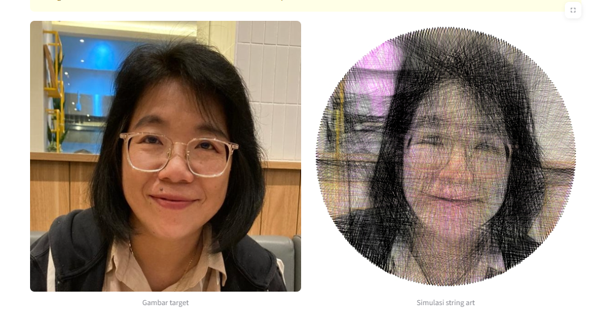

# 🧵 String Art Generator V4 (diameter Option)

Aplikasi Python untuk menghasilkan instruksi string art dari gambar. Mendukung mode **CMYK** (4 warna benang) dan **K-Only** (hitam saja), dengan image analysis otomatis dan parameter suggestion.



---

## Features

### `color-ai.py` — CMYK/K-Only String Art Generator (Streamlit)

- **Mode CMYK & K-Only** — pilih 4 warna benang atau hitam saja
- **Image analysis otomatis** — analisis brightness, edge density, color distribution → suggest parameter optimal
- **Weighted round-robin** — distribusi warna seimbang, bukan greedy murni
- **Highlight protection** — area terang (kulit, putih) tidak digaris
- **Empty-crossing penalty** — garis yang melewati area kosong kena penalti
- **Over-draw penalty** — area yang sudah penuh tidak ditambah lagi
- **Adaptive line strength per channel** — K lebih kuat, Y lebih lemah (sesuai visual dominance)
- **Anti-moiré system** — min line length, recent buffer, stride adaptif
- **Output detail** — panjang garis (px & mm), koordinat pin, estimasi kebutuhan benang
- **Percentile-based edge normalization** — hindari noise over-boost
- **Progress feedback realtime** — status precalculation & generating

### Legacy Scripts

| Script | Deskripsi |
|--------|-----------|
| `SA_GUI.py` | Tkinter GUI — grayscale string art dengan live preview |
| `SA_DQN.py` | DQN reinforcement learning approach |
| `SAapp.py` | CLI-based generator |

---

## Quick Start

### Setup

```bash
# Clone
git clone https://github.com/rudydwiantoro/ThreadArt.git
cd ThreadArt

# Virtual environment (recommended)
python -m venv venv
venv\Scripts\activate          # Windows
# source venv/bin/activate     # Linux/Mac

# Install dependencies
pip install -r requirements.txt
```

### Jalankan color-ai.py (Streamlit)

```bash
streamlit run color-ai.py
```

Browser otomatis terbuka di `http://localhost:8501`

### Jalankan legacy GUI

```bash
python SA_GUI.py
```

---

## Cara Pakai (color-ai.py)

1. **Upload gambar** (PNG/JPG) di sidebar kiri
2. Sistem otomatis menganalisis dan menampilkan:
   - Preview dekomposisi CMYK
   - Recommended settings berdasarkan karakteristik gambar
3. **Pilih mode**: CMYK (4 warna) atau K Only (hitam)
4. **Gunakan suggested settings** (checkbox ON) atau edit manual (OFF)
5. Klik **🚀 Generate** — progress bar & preview realtime
6. **Download CSV** sebagai instruksi robot/panduan manual

---

## Parameter Guide

### Basic

| Parameter | Fungsi | Range |
|-----------|--------|-------|
| Jumlah paku | Pin di keliling frame | 240-360 |
| Total tarikan | Jumlah garis total | 4000-6000 |
| Resolusi kerja | Resolusi kalkulasi internal | 400-550 |
| Edge boost | Prioritas kontur/tepi | 1.5-2.5 |
| Highlight protection | Protect area terang | 12-30 |
| Diameter frame (mm) | Ukuran fisik untuk kalkulasi benang | - |

### Advanced (Anti-Moiré)

| Parameter | Fungsi | Gejala kalau salah |
|-----------|--------|--------------------|
| Candidate stride | Lompatan scan pin | Kecil → moiré, Besar → diverse |
| Recent pins buffer | Pin blacklist terakhir | Kecil → pola repetitif/sisik |
| Min line length | Tolak garis pendek | Kecil → efek sisik spiral |

---

## Output CSV Format

| Kolom | Deskripsi |
|-------|-----------|
| STEP | Nomor urut garis (1-based) |
| COLOR | Warna benang (C/M/Y/K) |
| START_PIN | Pin awal (0-based) |
| END_PIN | Pin akhir (0-based) |
| START_ROW, START_COL | Koordinat pin awal (pixel) |
| END_ROW, END_COL | Koordinat pin akhir (pixel) |
| LENGTH_PX | Panjang garis (pixel) |
| LENGTH_MM | Panjang garis (mm) |
| SCORE | Skor efektivitas garis |

---

## Troubleshooting

| Masalah | Solusi |
|---------|--------|
| Hasil ada "sisik"/moiré | Naikkan min line length & recent buffer |
| Area terang kena garis | Naikkan highlight protection (25-35) |
| Terlalu gelap/over-draw | Kurangi total tarikan atau naikkan highlight |
| Proses freeze di awal | Normal — precalculate garis butuh 10-30 detik |
| Hasil tipis/jarang | Naikkan total tarikan, turunkan highlight |
| Garis kasar | Naikkan jumlah paku atau resolusi |

---

## Requirements

- Python 3.9+
- streamlit
- numpy
- pandas
- Pillow
- scikit-image

---

## License

[CC0](LICENSE)
